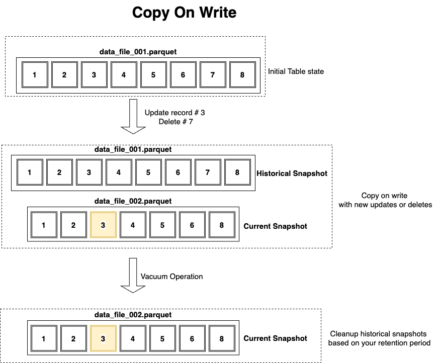
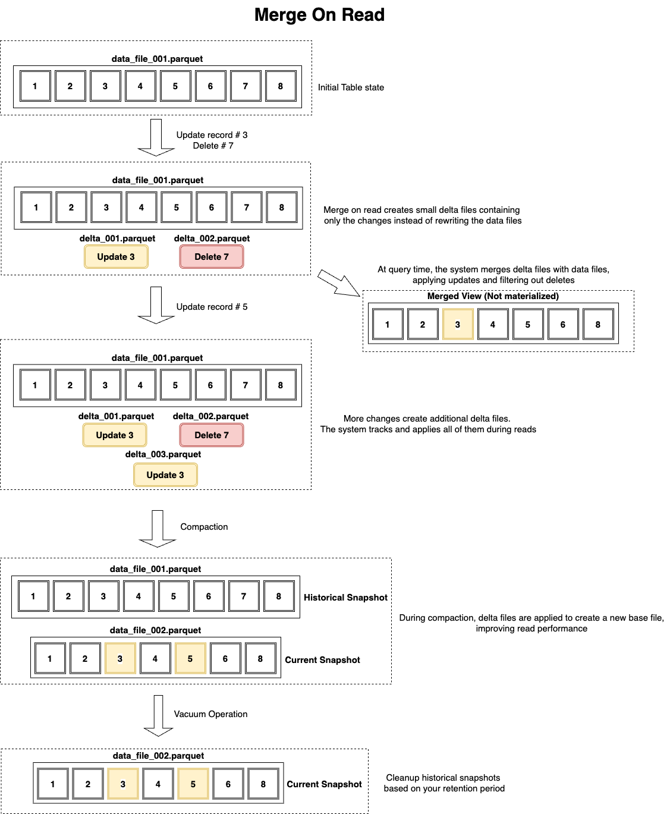

𝗔𝗽𝗮𝗰𝗵𝗲 𝗜𝗰𝗲𝗯𝗲𝗿𝗴 𝗠𝗲𝗿𝗴𝗲 𝗼𝗻 𝗥𝗲𝗮𝗱 𝘃𝘀 𝗖𝗼𝗽𝘆 𝗼𝗻 𝗪𝗿𝗶𝘁𝗲 𝘃𝘀 𝗛𝘆𝗯𝗿𝗶𝗱 𝗔𝗽𝗽𝗿𝗼𝗮𝗰𝗵

Both data modification strategies have their own uses and will really depend on your needs—whether your Iceberg tables are read-heavy or write-heavy. In some cases, you can leverage both with time-based strategies to get both benefits.

𝗖𝗼𝗽𝘆 𝗢𝗻 𝗪𝗿𝗶𝘁𝗲 (𝗖𝗼𝗪) 
Copy On Write is optimized for read-heavy workloads where updates and deletes are infrequent. When data is modified, Iceberg rewrites the entire data files containing the affected records. This creates a new version with all changes applied, making the old file obsolete (historical).

Performance characteristics:
↪️ Read performance: Excellent (no runtime merging required)
↪️ Write performance: Slower for large files (full file rewrites)
↪️ Storage efficiency: Lower initially (duplicate data until cleanup)
↪️ Query simplicity: High (data already in final form)

Ideal use cases:
↪️ Data warehousing with analytical workloads
↪️ ML feature stores requiring consistent reads
↪️ Dimension tables you need to frequently join in queries

𝗠𝗲𝗿𝗴𝗲 𝗢𝗻 𝗥𝗲𝗮𝗱 (𝗠𝗼𝗥) 
Merge On Read is optimized for write-heavy workloads. Iceberg records changes in separate delta files. These deltas are applied on-the-fly during queries.

Performance characteristics:
↪️ Read performance: Good but degrades with delta accumulation
↪️ Write performance: Excellent (minimal data written)
↪️ Storage efficiency: Higher (no data duplication)
↪️ Query complexity: Higher (runtime merging required)

Ideal Use Cases:
↪️ IoT and sensor data streams
↪️ User activity and state tracking
↪️ High-volume transaction systems

𝗛𝘆𝗯𝗿𝗶𝗱 𝗔𝗽𝗽𝗿𝗼𝗮𝗰𝗵 
Use MoR on "hot data" with regular compaction operations. Transition the older data to CoW based on your data age policies. In this approach, you get the write performance for fresh data and improved performance for historical analysis.